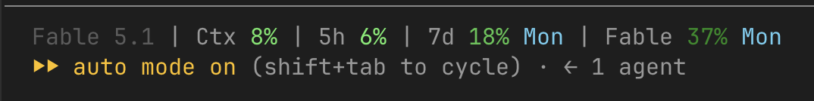

# context-statusline

A one line Claude Code statusline for macOS. It shows the model, context usage, the 5 hour and 7 day rate limits, and the Fable weekly limit, with the reset day next to the weekly ones.



Every percentage fades from bright to dark inside its band so you can see where you are without reading the number.

- 0 to 50%: bright green down to dark green
- 50 to 80%: bright yellow down to dark amber
- 80 to 100%: bright red down to dark red

The reset day is on its own blue ramp. It sits dim slate a week out and brightens to cyan as the reset gets close, so it never gets mixed up with the usage colours.

## Where the numbers come from

Claude Code hands the statusline a JSON payload with the context usage and the 5 hour and 7 day windows. It doesn't include the per model Fable window, so the script reads that from the same usage endpoint the `/usage` command uses. It pulls your Claude Code OAuth token out of the macOS keychain, calls `api.anthropic.com/api/oauth/usage`, and caches the response in `~/.claude/cache/usage-limits.json` for 60 seconds. The refresh runs in the background so the statusline never waits on the network. If the call fails the Fable segment shows `--` until the next refresh.

That call is a plain GET against your account, not a model request. It doesn't use tokens or count against your rate limits.

## Before you use it

1. macOS only. It relies on `security` for the keychain and the BSD versions of `stat` and `date`.
2. You need a Claude Pro or Max subscription. API key, Bedrock, and Vertex users don't get rate limit data at all, so those segments show `--`.
3. The usage endpoint and its `anthropic-beta` header are not documented. I pulled them out of the Claude Code binary and they can change without notice.
4. Anthropic's terms restrict using your subscription's OAuth token outside Claude Code. This is a read only call and other usage widgets do the same thing, but it isn't officially supported, so decide for yourself.

The token is only ever held in memory. It is never written to disk or printed, and the cache file holds just the usage response.

## Requirements

`jq` and `curl`. `curl` ships with macOS and `jq` is `brew install jq`.

## Install

1. Clone this repo into `~/.claude/plugins/data/context-status`:

   ```sh
   git clone https://github.com/allen-padilla/context-statusline.git ~/.claude/plugins/data/context-status
   ```

2. Add this to `~/.claude/settings.json`:

   ```json
   {
     "statusLine": {
       "type": "command",
       "command": "bash \"$HOME/.claude/plugins/data/context-status/statusline.sh\"",
       "padding": 0
     }
   }
   ```

3. Restart Claude Code or run `/statusline` to refresh.
